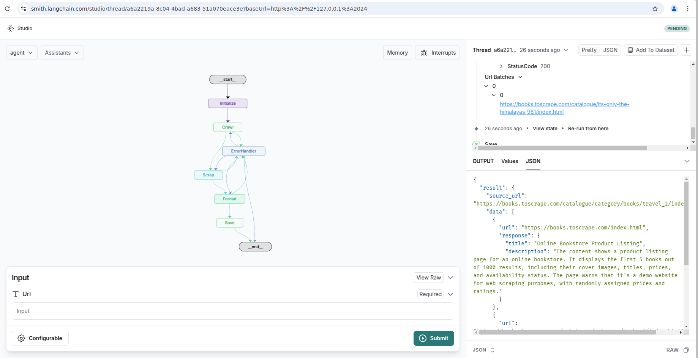
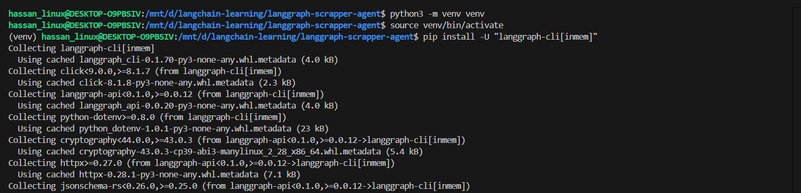
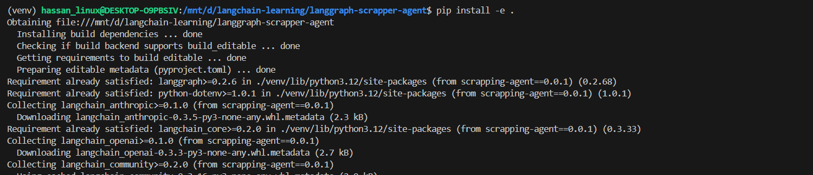
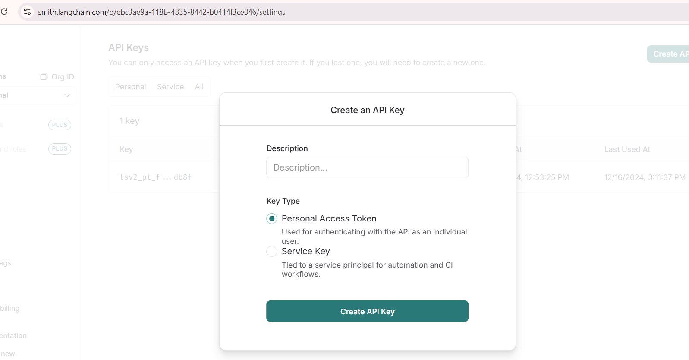
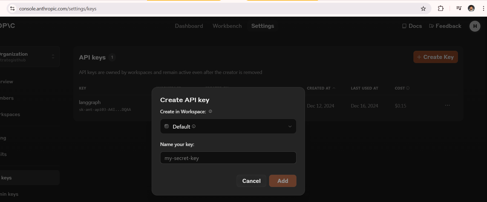
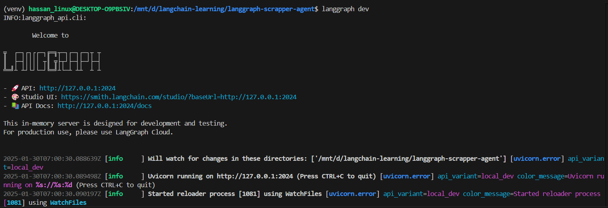
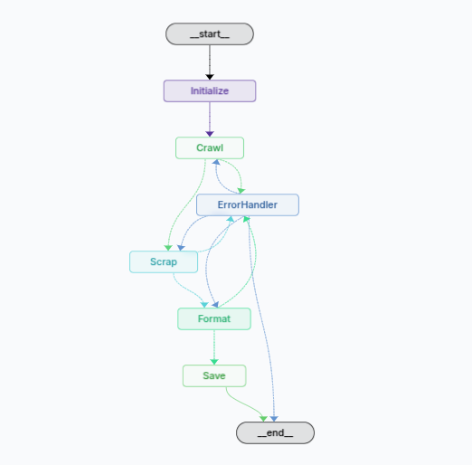

# 🚀 Scraping Agent AI

  

An AI-powered **web scraping agent** that automates data extraction from websites with intelligent crawling, anti-bot detection, and structured data parsing. Built using **LangGraph**, **LangSmith**, **Firecrawl**, and **Anthropic AI tools** for seamless AI-driven web scraping and structured data processing.

## 🔥 Features
- **Graph-based AI Agent**: Uses LangGraph for managing scraping workflows.
- **Intelligent Web Crawling**: Powered by Firecrawl to extract structured data.
- **LLM-Powered Formatting**: Uses Anthropic AI for content summarization.
- **Adaptive Error Handling**: Retries failed requests dynamically.
- **Batch Processing**: Efficiently processes multiple URLs with batched requests.
- **Flexible Output Formats**: Supports JSON, Markdown, and more.

---

[](demo.gif)



---

## 🛠️ Setup Instructions

Follow these steps to set up and run the project on your local machine:

### 1. Clone the Repository
```bash
git clone https://github.com/hmshb/scraping-agent-ai
cd scraping-agent-ai
```

### 2. Create a Virtual Environment
```bash
python -m venv venv
source venv/bin/activate  # For Linux/Mac

.\venv\Scripts\activate # For Windows
```

### 3. Install LangGraph CLI
```bash
pip install -U "langgraph-cli[inmem]"
```



### 4. Install Other Dependencies
```bash
pip install -e .
```



---

### 5. Generate LangSmith API Key
1. Visit [LangSmith](https://smith.langchain.com/settings).
2. Create an API key for accessing LangSmith logs.
3. Copy the generated API key.



---

### 6. Generate Anthropic Claude API Key
1. Visit [Anthropic](https://console.anthropic.com/settings/keys).
2. Create an API key for accessing Claude.
3. Copy the generated API key.



---

### 7. Configure the Environment Variables
 - Copy the `.env.example` file and rename it to `.env`:
   ```bash
   cp .env.example .env
   ```
 - Open the `.env` file and update the API keys and configuration values:
   ```
   LANGSMITH_PROJECT=scrapping-agent
   LANGSMITH_API_KEY=your_api_key_here
   ANTHROPIC_API_KEY=your_api_key_here
   FIRECRAWL_API_KEY=your_api_key_here
   URL_LIMIT=10
   BATCH_LIMIT=5
   ```

### 8. Run the project
```bash
langgraph dev
```



---

### 9. LangGraph of the AI Agent



---

## 📂 Project Structure
```
scraping-agent-ai/
├── .env                 # API key configuration file
├── agent/               # Main AI scraping agent module
│   ├── utils/           # Utility modules for various tasks
│   │   ├── constants.py # Constants for scraping tasks
│   │   ├── firecrawl.py # Firecrawl integration
│   │   ├── graph.py     # LangGraph-based workflow
│   │   ├── helpers.py   # Utility functions
│   │   ├── llm.py       # LLM-powered formatting
│   │   ├── nodes.py     # Graph-based nodes
│   │   ├── states.py    # Scraping state management
│   ├── agent.py         # AI-driven scraping workflow
├── langgraph.json       # LangGraph configuration file
├── pyproject.toml       # Python project metadata
├── README.md            # Documentation file
├── scraped_data.json    # This will have the final data
├── venv/                # Virtual environment
```

---

## ⭐ Acknowledgments

Special thanks to:

- **[LangGraph](https://langchain-ai.github.io/langgraph/)** for building graph-based AI workflows.
- **[LangSmith](https://www.langchain.com/langsmith)** for debugging and monitoring AI agents.
- **[Firecrawl](https://firecrawl.com/)** for powerful web crawling and data extraction.
- **[Anthropic AI](https://www.anthropic.com/claude)** for AI-powered text summarization and formatting.

---

## 📜 License

This project is open-source and licensed under the [MIT License](LICENSE).

---

## 📢 Get Involved!

If you find this repository helpful, please consider:

- ⭐ **Starring the Repository** to show your support.
- 📤 **Forking the Repository** to explore further and make your own customizations.
- 💬 **Sharing Your Feedback** by opening issues or discussions.

---

## 📝 Notes

**LangGraph**, **LangSmith**, **Claude** and **FireCrawl** is currently in limited or preview release (depending on your region and timing), and integration details may change as the service evolves. 
 
Always refer to official documentation for the most up-to-date guidance.

### Let's build smart, scalable AI-powered web scrapers together! 🚀
